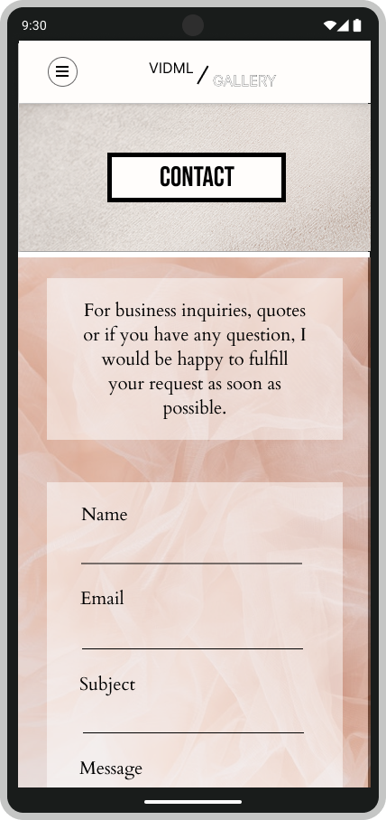

    <h1><b>VIDML Website</b></h1>
    <h4>(work in progress)</h4>
    <h4>
        <a href="#about">Visuals</a>
        •
        <a href="#built-with">Built with</a>
        •
        <a href="#contact">Credits</a>
    </h4>

## Table of contents

- [Table of contents](#table-of-contents)
- [Visuals](#visuals)
- [Built with](#built-with)
- [Credits](#credits)

## Visuals

 
    
    
    
    

## Built with

Frontend
* 
* 
* 
* 

Backend/Database
* 
* 
* 

## Credits

Diane M.

